# Introduction:
Greeneries is an android application where users can purchase indoor and outdoor plants easily from the sellers, and also can get the service for helping in the plantation. This platform will be beneficial for both plant lover users and sellers of the plants for purchasing and selling at a reliable price. Our project is designed in a state so that it can be deployed in commercial utilization. People from cities especially do not get the opportunities to purchase indoor and outdoor plants which are grown in rural areas by our farmers also the rural farmers cannot get the opportunity to sell their plants to the enlarged group of customers. There are many Facebook pages available for purchasing plants but some of these are not reliable in both price and quality of the plant. To solve this, we are introducing “**Greeneries**” for the plant enthusiast and creating an easy and reliable platform for the sellers as well. Furthermore, users can get a service in terms of planting tips and tricks from our service providers.  

# Related App:
` `There are not any apps available for purchasing and selling indoor/outdoor plants online. There are apps available like “Garden Manager” plant alarm where the users can get various alarms for taking care of plants. This app also features plant photo logs and sharing, to capture the experience of writing notes about harvesting and sharing with friends. But our “Greeneries” app has certain features like vlogs where the user can post about plant queries and share in the platform. 

# Methodology: 
We have tried to make our app as user-friendly as much as possible. The flowchart of our application is given below.

# Icon
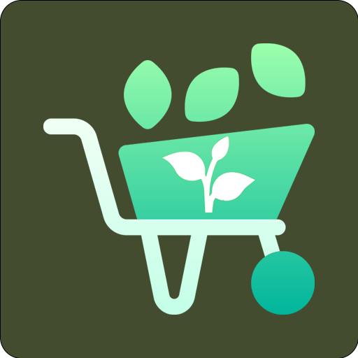

# Overview of Greeneries App:

                                                 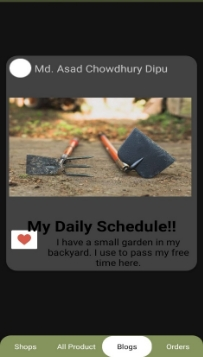

Fig1: All product Activity                                                             Fig2: Blog Activity

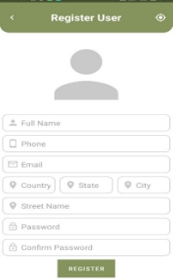                                                 

Fig3: Register Activity (Seller, Buyer)                                 Fig4: Register Activity(Seller, Buyer)

`    `                                                          

`          `Fig5: Splash Screen                                                                          Fig6: Login in

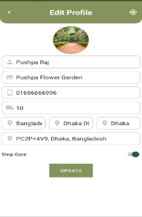                                                      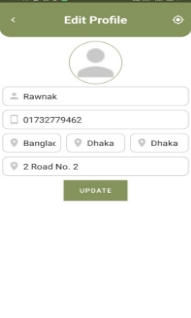

Fig7: Edit Profile Activity (Seller)                                            Fig8: Edit Profile Activity(Buyer)

                                                     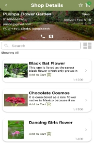

Fig9: Recovery password Activity                                             Fig10: Shop Details Activity
**

                                                   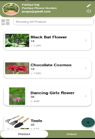

Fig11: Shop List Activity                                              Fig12: Shop Details Activity (Seller UI)

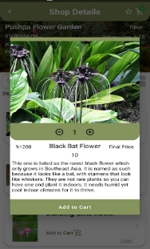	                                              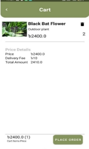

Fig13: Add to card Activity                                                     Fig14: Card Activity                                                     

                                                      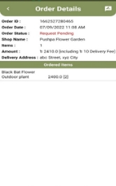

Fig15: Payment Activity                                                           Fig16: Order Details Activity

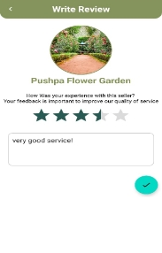

Fig17: Write review Activity

# Business Model:
There are multiple business models available through apps. Our business strategy for building this app is Free for customers and sellers. Initially, our app will be free of cost to use but in the future, we will be making our app “Free, but with ads (in-app advertising)” as well as we will take the commission on each purchase plant. 

# Conclusion:
The Greeneries app is the first platform where the users and sellers come together for purchasing or selling indoor/ outdoor plants. This platform can be rebuilt by any community but for future work, we are planning to upgrade the blog sections, for the user-friendly approach of the app we are also planning initiatives with comment options, and chat options as well.

## 🔗 Links

